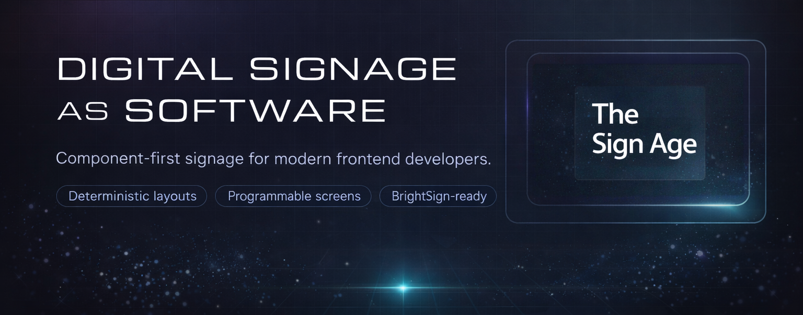

# WallRun

> **Formerly "The Sign Age"** — same project, new name.




**NOTE: This project is currently in alpha. In fact, it's very alpha. This means it is still under active development and may undergo significant changes. Features may be incomplete or unstable. Got suggestions on what you would like to see or how to make it better? Add an issue and let us know!**

## What This Is (and Why It Exists)

**WallRun** is a developer-first workspace for building **real digital signage** with modern web tooling — especially targeting **BrightSign OS 9.x players**.

If you've ever thought “this should just be a React app,” this repo is the missing glue:

- A **signage-oriented component library** (`@wallrun/shadcnui-signage`) built for distance readability and fixed-aspect layouts
- A **packaging + deploy workflow** for BrightSign players (no manual ZIP rituals)
- **Git-safe player management** (no IPs or credentials committed)
- **Player discovery tooling** to find devices on your local network

### Designed for VS Code + GitHub Copilot

This repo is intentionally set up to work well in **VS Code** with **GitHub Copilot**:

- Opinionated Copilot instructions to keep AI output consistent
- Built-in agent(s) for signage screen construction and platform-aware guidance
- MCP support for BrightSign platform docs research
- **[Copilot Agent Plugin](./copilot-plugins/wallrun-signage/)** — Install curated signage skills and agents into any VS Code workspace

### What this is not

**WallRun is not a content management system (CMS).** It's a development framework for building custom signage applications with React.

#### When to use established CMS platforms instead

**If you don't need to write custom React code**, we recommend using proven BrightSign-compatible CMS platforms. In our opinion, these are excellent choices:

- **[Embed Signage](https://www.embedsignage.com/)** - Known for 4K support, touch interactivity, and comprehensive analytics
- **[Korbyt](https://www.gokorbyt.com/partners/hardware-partners/brightsign/)** - Best for enterprise-level, dynamic, and scalable content management
- **[Navori](https://navori.com/app/brightsign/)** - Ideal for large, high-performance digital signage networks
- **[Signagelive](https://support.signagelive.com/en/articles/137967-signagelive-for-brightsign-overview)** - Highly compatible cloud-based CMS for diverse applications

**Use WallRun when:**

- You need complete control over UI/UX with custom React components
- You're building bespoke signage experiences that don't fit CMS templates
- You want to integrate signage with custom data sources and business logic
- You're a web developer comfortable with React, TypeScript, and version control

#### Additional disclaimers

- Not official BrightSign documentation (refer to [BrightSign docs](https://docs.brightsign.biz/) for platform details)
- Not a replacement for [BSN.cloud](https://www.brightsign.biz/resources/bsn-cloud/) (BrightSign's official cloud platform)

## 🚀 Quick Start

### Option 1: See It Running Locally (30 seconds)

No BrightSign player needed. Just clone, install, and run:

```bash
git clone https://github.com/CambridgeMonorail/WallRun.git
cd WallRun
pnpm install
pnpm serve:client
```

Open [http://localhost:4200/WallRun/](http://localhost:4200/WallRun/) to explore signage examples, component library, and documentation.

**Or browse online:**

- **Live Demo:** [https://cambridgemonorail.github.io/WallRun/](https://cambridgemonorail.github.io/WallRun/)
- **Storybook:** [https://cambridgemonorail.github.io/WallRun/storybook/](https://cambridgemonorail.github.io/WallRun/storybook/)

---

### Option 2: Deploy to BrightSign Player (5 minutes)

Have a BrightSign OS 9.x player on your network? Deploy in 3 commands:

```bash
# 1. Initialize player configuration
pnpm setup:dev

# 2. Auto-discover players on your LAN (optional but recommended)
pnpm discover
# → Shows all BrightSign players with IP, model, and serial number

# 3. Add your player and deploy
pnpm player add my-player 192.168.1.50 --default
pnpm deploy:player

# Deploy a different player app or target a named player
pnpm deploy:player -- --app player-minimal --player my-player
```

Your React app is now running on the BrightSign player. Changes? Run `pnpm deploy:player` again, or use `pnpm deploy:player -- --app <app-name>` for a specific player app.

**Full guides:**

- [BrightSign Deployment Guide](./docs/guides/brightsign-deployment.md) - Packaging, deployment, troubleshooting
- [Player Configuration](./docs/guides/brightsign-player-config.md) - Registry management, git-safe config
- [Player Discovery Tool](./tools/player-discovery/README.md) - Find devices on your LAN

---

### Option 3: Build Your Own Signage

Use the signage component library to create custom screens:

```bash
# Create a new BrightSign player app scaffold
pnpm scaffold:player --name player-arrivals
# Or use the Nx-native generator directly
pnpm nx g wallrun:player-app --name player-arrivals

# Start Storybook to browse components
pnpm serve:storybook
```

Components are in `libs/shadcnui-signage/` with:

- Distance-readable typography (10-foot rule)
- Fixed-aspect layouts for 1080p/4K screens
- Primitives, layouts, and blocks for signage

**Guides:**

- [Creating Signage Content](./docs/guides/creating-signage-content.md) - Design principles + examples
- [Component Library README](./libs/shadcnui-signage/README.md) - API reference
- [Registry README](./apps/client/public/registry/README.md) - shadcn registry setup + install commands

#### Install Signage Components

The signage components are distributed through a shadcn-compatible registry. Install them into your own project with:

```bash
npx shadcn@latest add https://cambridgemonorail.github.io/WallRun/registry/registry.json auto-paging-list
```

You can also browse the available components and installation options in:

- [apps/client/public/registry/README.md](./apps/client/public/registry/README.md)
- [apps/client/src/app/pages/getting-started/GettingStarted.tsx](./apps/client/src/app/pages/getting-started/GettingStarted.tsx)

#### Install Portable Skills

The repository also exposes portable `SKILL.md` workflows that can be installed with the open skills CLI:

```bash
npx skills add CambridgeMonorail/WallRun
```

For the available skills and the Copilot mirror model, see:

- [skills/README.md](./skills/README.md)
- [docs/tooling/github-copilot-tooling.md](./docs/tooling/github-copilot-tooling.md#skills)

#### Install Copilot Agent Plugin

WallRun also ships a **Copilot agent plugin** — a curated bundle of 14 signage skills and 2 agents that you can install into any VS Code workspace without cloning the entire monorepo.

**Option A — Local path** (if you already have the repo):

Add to your VS Code settings:

```json
"chat.pluginLocations": {
  "/path/to/WallRun/copilot-plugins/wallrun-signage": true
}
```

**Option B — Install from repo URL** (no clone needed):

In VS Code, run **Chat: Install Plugin From Source** from the Command Palette and enter the WallRun repo URL.

See the [plugin README](./copilot-plugins/wallrun-signage/README.md) for full details.

---

## ✨ Key Features

- **`@wallrun/shadcnui-signage`** - Signage-specific React components (distance-readable, deterministic rendering)
- **One-command deployment** - `pnpm deploy:player` packages and deploys to BrightSign OS 9.x
- **Player discovery** - Find all BrightSign devices on your LAN automatically
- **Git-safe configuration** - No IPs or credentials committed (uses `.brightsign/players.json`, git-ignored)
- **AI-accelerated development** - GitHub Copilot agents for signage workflows ([Signage Architect](./.github/agents/signage-architect.agent.md))
- **Production examples** - Restaurant menus, office directories, KPI dashboards, event schedules

---

## Overview

**WallRun** is an exploration of digital signage as software.

This repository exists to document, prototype, and share practical work around building bespoke, generative, and data-driven content for digital signage players—especially **BrightSign** devices—from the perspective of experienced frontend developers.

Digital signage is often treated as a solved problem: templates, slide decks, CMS tools, and marketing abstractions. That works for some use cases, but it leaves a large amount of creative and technical potential unexplored.

This project starts from a different assumption: signage screens are computers bolted to walls.

## Statement of Intent

The intent of this repository is to:

- Treat signage players as programmable systems, not presentation tools
- Translate signage concepts into mental models familiar to web and frontend engineers
- Explore what is possible when modern web technologies meet always-on, unattended hardware
- Be honest about constraints, quirks, trade-offs, and failure cases
- Share real experiments, not polished marketing narratives

This is not a CMS. This is not official BrightSign documentation. It is a working notebook for people who already know how to build software and want to apply that skill to screens that live in physical space.

If something here feels unfinished, opinionated, or slightly uncomfortable, that is intentional. The goal is to surface the edges of the platform, not to smooth them away.

**Signage is software. It deserves to be treated as such.**

## What This Repo Contains

This is an **Nx + pnpm** monorepo with a focus on tooling and reusable UI building blocks for signage:

### Component Libraries

- **`libs/shadcnui-signage`** ⭐ - **Primary focus**: Signage-specific React components
  - Distance-readable typography (10-foot rule)
  - Fixed-aspect primitives, layouts, and blocks
  - Deterministic rendering for 1080p/4K screens
  - Designed for always-on, unattended displays
  - [View in Storybook](https://cambridgemonorail.github.io/WallRun/storybook/?path=/docs/1-signage-primitives-screenframe--docs) | [Source](./libs/shadcnui-signage/)

- **`libs/shadcnui` / `libs/shadcnui-blocks`**: Supporting component primitives (our copy of shadcn/ui) and compositions for demo website

### Applications

- **`apps/client`**: Demo site showcasing signage examples and components (**[View Live Demo](https://cambridgemonorail.github.io/WallRun/)**)
- **`apps/player-minimal`**: BrightSign deployment target with status monitoring (**[Deployment Guide](./docs/guides/brightsign-deployment.md)**)
- **Storybook**: Interactive component documentation (**[Browse Components](https://cambridgemonorail.github.io/WallRun/storybook/)**)

### Deployment Tools

- **`scripts/package-player.mjs`** - Package React apps for BrightSign OS 9.x with autorun.brs bootstrap
- **`scripts/deploy-local.mjs`** - Deploy to local BrightSign players primarily via LDWS over HTTPS (port 443, digest auth), with HTTP used only when a non-443 port is explicitly configured
- **`skills/brightsign-*` / `skills/player-discovery-*`** - Portable `SKILL.md` workflows for BrightSign packaging, deployment, runtime guidance, and LAN discovery, mirrored to `.github/skills/` for Copilot ([docs](./docs/tooling/github-copilot-tooling.md#skills))

### Signage Skills

- **`skills/signage-layout-system/`** - Full-screen wall-display layout rules for distance readability and glanceable hierarchy
- **`skills/signage-animation-system/`** - Public-display motion guidance for calm, loop-safe, always-on animation
- **`skills/brightsign-runtime/`** - BrightSign runtime constraints for static deployment, media behavior, and embedded stability

### AI Accelerators

- **`.github/agents/signage-architect.agent.md`** - GitHub Copilot agent for building premium signage screens.
  Emphasizes distance readability, deterministic layouts, and 24/7 operation. Can pair with the signage and BrightSign runtime skills for wall-screen layout, motion, and playback constraints. Enforces signage design principles instead of website patterns and integrates with BrightSign platform documentation via MCP. [View agent definition](./.github/agents/signage-architect.agent.md)

### Demo Site

The demo site (`apps/client`) showcases digital signage concepts in action:

- **Landing Page**: Explains the project purpose and approach
- **Getting Started**: Shows component installation paths and first-use guidance
- **Component Library**: Explains what each library is, what registry support means, and where to browse reference docs
- **Gallery**: Directory of full-screen signage examples
- **Signage Examples**: Welcome screens, restaurant menus, office directories, KPI dashboards, announcements boards, and event schedules

Run `pnpm run serve:client` and visit `http://localhost:4200/WallRun/` to explore the examples.

## Developer Tooling

This repo is designed to feel familiar to frontend engineers:

- **React 19 + Vite** for fast local development
- **TypeScript (strict)** for safe iteration
- **Tailwind CSS v4 + shadcn/ui** for rapid UI composition
- **Vitest + Testing Library** for unit/component tests
- **Playwright** for E2E tests (when the UI flow is critical)
- **Nx “affected” workflows** to keep validation fast (`lint`, `type-check`, `test`, `build`)

It also includes opinionated workflow support:

- **`pnpm verify`** as the “definition of done”
- **GitHub Copilot instructions + agents** to keep AI-assisted work consistent
- **MCP server configuration** (including BrightDeveloper) to support device/platform research

## Technologies Used

[](https://reactjs.org/)
[](https://www.typescriptlang.org/)
[](https://nodejs.org/)
[](https://nx.dev/)
[](https://www.markdownguide.org/)
[](https://pnpm.io/)
[](https://vitejs.dev/)
[](https://github.com/)
[](https://github.com/features/actions)
[](https://tailwindcss.com/)
[](https://ui.shadcn.dev/)
[](https://reactrouter.com/)
[](https://vitest.dev/)
[](https://playwright.dev/)
[](https://code.visualstudio.com/)
[](https://github.com/features/copilot)

- **React**: [A JavaScript library for building user interfaces.](https://reactjs.org/)
- **TypeScript**: [A typed superset of JavaScript that compiles to plain JavaScript.](https://www.typescriptlang.org/)
- **Node.js**: [A JavaScript runtime built on Chrome's V8 JavaScript engine.](https://nodejs.org/)
- **Nx**: [A set of extensible dev tools for monorepos, which helps in managing and scaling the project.](https://nx.dev/)
- **Markdown**: [A lightweight markup language for creating formatted text using a plain-text editor.](https://www.markdownguide.org/)
- **pnpm**: [A fast, disk space-efficient package manager.](https://pnpm.io/)
- **Vite**: [A build tool that provides a faster and leaner development experience for modern web projects.](https://vitejs.dev/)
- **GitHub**: [A platform for version control and collaboration.](https://github.com/)
- **GitHub Actions**: [A CI/CD service that allows you to automate your build, test, and deployment pipeline.](https://github.com/features/actions)
- **Tailwind CSS**: [A utility-first CSS framework for styling the components.](https://tailwindcss.com/)
- **shadcn/ui**: [A set of reusable UI components for consistent design.](https://ui.shadcn.dev/)
- **React Router**: [A library for routing in React applications.](https://reactrouter.com/)
- **Vitest**: [A Vite-native unit testing framework.](https://vitest.dev/)
- **Playwright**: [An end-to-end testing framework.](https://playwright.dev/)
- **Visual Studio Code**: [A source-code editor made by Microsoft for Windows, Linux, and macOS.](https://code.visualstudio.com/)
- **GitHub Copilot**: [An AI pair programmer that helps you write code faster and with less work.](https://github.com/features/copilot)

## Installation

To install the project, follow these steps:

1. Clone the repository:

   ```sh
   git clone https://github.com/CambridgeMonorail/WallRun.git
   ```

2. Navigate to the project directory:

   ```sh
   cd WallRun
   ```

3. Install dependencies:

   ```sh
   pnpm install
   ```

## Usage

To run the demo site locally:

```sh
pnpm run serve:client
```

To run the BrightSign player app locally:

```sh
pnpm run serve:player
```

To create a production bundle:

```sh
pnpm run build:affected
```

To see all available targets to run for a project, run:

```sh
npx nx show project client
```

These targets are either [inferred automatically](https://nx.dev/concepts/inferred-tasks?utm_source=nx_project&utm_medium=readme&utm_campaign=nx_projects) or defined in the `project.json` or `package.json` files.

[More about running tasks in the docs &raquo;](https://nx.dev/features/run-tasks?utm_source=nx_project&utm_medium=readme&utm_campaign=nx_projects)

## Common Commands

### Local Development

```bash
pnpm serve:client          # Run demo site (http://localhost:4200/WallRun/)
pnpm serve:player          # Run BrightSign player app locally
pnpm serve:storybook       # Browse component library
```

### BrightSign Deployment

```bash
pnpm setup:dev             # Initialize player configuration
pnpm discover              # Find all BrightSign players on your LAN
pnpm player list           # Show registered players
pnpm player add <name> <ip> --default  # Add a player
pnpm deploy:player         # Build and deploy to default player
pnpm deploy:player -- --app <app-name> --player <name>  # Target a specific app and player
```

**See [BrightSign Deployment Guide](./docs/guides/brightsign-deployment.md) for troubleshooting and advanced workflows.**

### Validation

```bash
pnpm verify                # Fast: format, lint, type-check, test (affected only)
pnpm validate              # Comprehensive: all projects, slower
```

### Building

```bash
pnpm build:affected        # Build changed projects only
pnpm build:all             # Build everything
```

## Documentation

### Quick Links

- **[BrightSign Deployment Guide](./docs/guides/brightsign-deployment.md)** ⭐ - Package + deploy to BrightSign OS 9.x
- **[BrightSign Player Configuration](./docs/guides/brightsign-player-config.md)** ⭐ - Player registry + git-safe config
- **[Player Discovery Tool](./tools/player-discovery/README.md)** ⭐ - Discover players on your LAN
- **[Copilot Agent Plugin](./copilot-plugins/wallrun-signage/README.md)** ⭐ - Install signage skills + agents into any workspace
- **[Creating Digital Signage Content](./docs/guides/creating-signage-content.md)** - Guide to building premium signage screens
- **[Guides](./docs/guides/README.md)** - Practical how-to tutorials
- **[Getting Started](./docs/getting-started/README.md)** - Project structure and setup
- **[Documentation Index](./docs/README.md)** - Full documentation overview
- **[BrightSign Testing Checklist](./TESTING_BRIGHTSIGN.md)** - End-to-end validation steps

### Key Resources

- Signage component library: [libs/shadcnui-signage/README.md](./libs/shadcnui-signage/README.md)
- Copilot + workflow tooling: [docs/tooling/github-copilot-tooling.md](./docs/tooling/github-copilot-tooling.md)
- Agent workflows: [AGENTS.md](./AGENTS.md)

## Roadmap

See [ROADMAP.md](./ROADMAP.md) for the project's development plan, including:

- ✅ Completed features (Q4 2025 - Q1 2026)
- 🚧 In-progress work (Component enrichment, documentation)
- 📋 Planned features (Q2 2026: DataFetcher, WeatherWidget, QRCodeDisplay, etc.)
- 🔮 Future vision (Platform integration, content management, industry templates)

**Target for v1.0:** Q3 2026

## Contributing

Contributions are welcome! Please open an issue or submit a pull request for any changes. For detailed guidelines on how to contribute, see [Contributing](./docs/contributing/CONTRIBUTING.md).

### Contributing / Security / Issues

- Contributing guide: [docs/contributing/CONTRIBUTING.md](./docs/contributing/CONTRIBUTING.md)
- Code of Conduct: [CODE_OF_CONDUCT.md](./CODE_OF_CONDUCT.md)
- Security policy: [SECURITY.md](./SECURITY.md)
- Issues: [github.com/CambridgeMonorail/WallRun/issues](https://github.com/CambridgeMonorail/WallRun/issues) (bug reports, feature requests, and docs improvements)

## License

This project is licensed under the MIT License.

## Acknowledgments

- [joshuarobs/nx-shadcn-ui-monorepo](https://github.com/joshuarobs/nx-shadcn-ui-monorepo)
- [Shadcn UI](https://github.com/shadcn-ui/ui)
- [Nx](https://nx.dev)
- [BrightDev MCP Server](https://github.com/BrightDevelopers/BrightDev): Model Context Protocol server providing access to BrightSign platform documentation for AI-assisted development
- [Placebeard](https://placebeard.it/): A fantastic service for placeholder images featuring bearded individuals, inspired by similar services like placekitten.com and placedog.com. We appreciate their free service for adding a touch of fun to our project.
- [unDraw](https://undraw.co/): Open-source illustrations for any idea you can imagine and create. A constantly updated design project with beautiful SVG images that you can use completely free and without attribution. Created by [Katerina Limpitsouni](https://x.com/ninaLimpi).
- [Shadcn UI Theme Generator](https://www.readyjs.dev/tools/shadcn-ui-theme-generator): A tool for generating themes for Shadcn UI.

## Useful Links

- [Nx docs](https://nx.dev/)
- [shadcn/ui](https://ui.shadcn.dev/)
- [Tailwind CSS](https://tailwindcss.com/)
